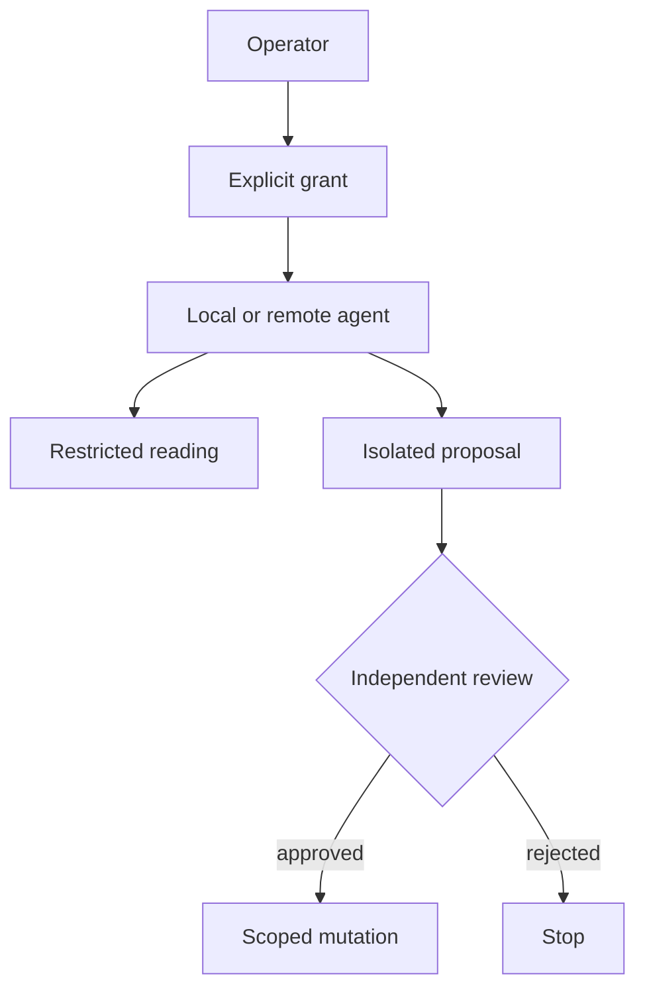

# Authority & agents

> Status: methodological draft, to be adapted — not ratified in consuming projects.

## Authority is a capability, not a tone
Confident agent output conveys no permission. A **scoped capability** identifies resources, allowed operations, and expiry.

| Zone | Examples | Rule |
|---|---|---|
| Observation | read files and tests | no mutation |
| Proposal | produce isolated patch | no integration |
| Scoped mutation | write approved paths | review diff |
| Integration | merge branches | separate gate |
| Publication | public push, DNS, deploy | dedicated approval |

### LLM boundaries
Copilot as an interface does not prove prompts stay local. Verify actual model provider, egress, telemetry, extensions, child processes and logs before exposing private sources or secrets.

### No transitive grants
Permission to write a worktree does not imply permission to change `main`, push, manipulate keys or approve your own change.

### Exercise
Specify an agent that may edit `examples/` but never `src/`, and report tests without network access.

Self-check
Explicit allow `examples/**`, deny `src/**`, forbid network and push, and set grant expiry. Logs are evidence, not authority.

## Engineering problem
Fictional Courier wants to write a report; its agent has only read permission.

## Reproducible method
1. List resource, operation and expiry
2. check the grant at execution
3. deny absent operations by default
4. distinguish a local proposal from an authorized push
5. log denial without copying protected data.

**Responsibilities:** the author proposes and records results; the reviewer challenges the oracle; the consuming project owner decides adoption.

## Example, counterexample and failure
Example: write examples/report.txt until a UTC deadline. Counterexample: a hidden button serves as access control. Failure: grants are checked before a wait then used after expiry; recheck at execution.

## Artifacts and qualification
Capability table; allowed, denied and expired cases; trace of zero writes on denial.

Each denied case leaves the sentinel file byte-identical. The trace covers instrumented operations, not the absence of every network exit.

## Transfer exercise
Apply this method to fictional Courier. Produce the artifacts above, then invent a case that invalidates an overbroad conclusion.

Transfer self-check
The case is fictional and reproducible; baseline is identified; procedure and expected result are explicit; a failure is retained; the conclusion cites artifacts and limits. If any criterion is missing, revise before declaring the method applied.

