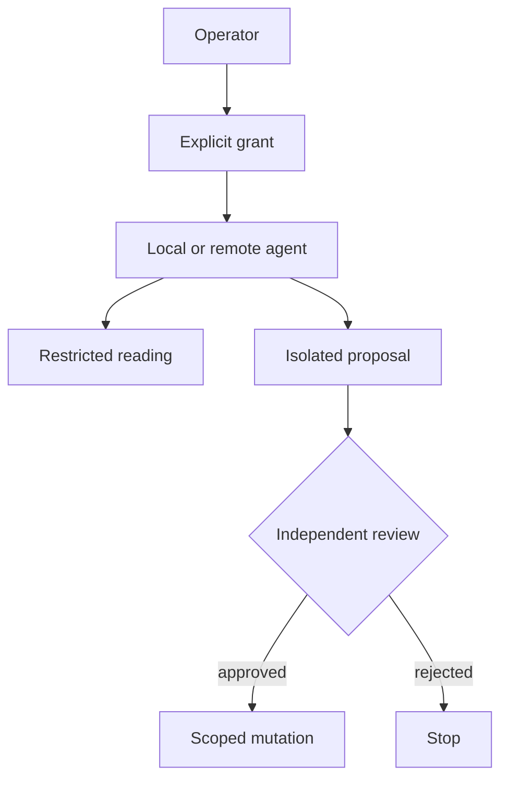

# Authority & agents

> Status: methodological draft, to be adapted — not ratified in consuming projects.

## Authority is a capability, not a tone
Confident agent output conveys no permission. A **scoped capability** identifies resources, allowed operations, and expiry.

| Zone | Examples | Rule |
|---|---|---|
| Observation | read files and tests | no mutation |
| Proposal | produce isolated patch | no integration |
| Scoped mutation | write approved paths | review diff |
| Integration | merge branches | separate gate |
| Publication | public push, DNS, deploy | dedicated approval |

### LLM boundaries
Copilot as an interface does not prove prompts stay local. Verify actual model provider, egress, telemetry, extensions, child processes and logs before exposing private sources or secrets.

### No transitive grants
Permission to write a worktree does not imply permission to change `main`, push, manipulate keys or approve your own change.

### Exercise
Specify an agent that may edit `examples/` but never `src/`, and report tests without network access.

Self-check
Explicit allow `examples/**`, deny `src/**`, forbid network and push, and set grant expiry. Logs are evidence, not authority.

