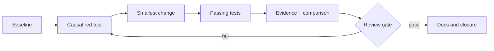

# Delivery & verification

> Status: methodological draft, to be adapted — not ratified in consuming projects.

## RED → GREEN → evidence
A slice begins with an oracle failing for the expected reason, implements the smallest change, then records results. `GREEN` without environment control is insufficient.

| Gate | Minimum observation |
|---|---|
| Preflight | Git status, tool versions |
| Causality | expected initial failure |
| Fix | targeted tests pass |
| Non-regression | adjacent tests + lint |
| Quality | diff check + security |
| Closure | commit, limits, proof |

### Isolation
One worktree or sandbox per independent slice. Never treat `main` as a testbench or remote CI as the only reproducibility evidence.

### Exercise
Write a gate that rejects an unexpected change in event count. Why is count alone inadequate?

Self-check
Also check sorted identities or inventory digest; any exception needs causal evidence.

