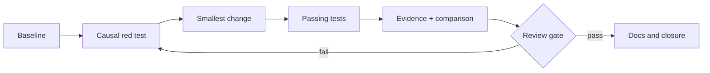

# Delivery & verification

> Status: methodological draft, to be adapted — not ratified in consuming projects.

## RED → GREEN → evidence
A slice begins with an oracle failing for the expected reason, implements the smallest change, then records results. `GREEN` without environment control is insufficient.

| Gate | Minimum observation |
|---|---|
| Preflight | Git status, tool versions |
| Causality | expected initial failure |
| Fix | targeted tests pass |
| Non-regression | adjacent tests + lint |
| Quality | diff check + security |
| Closure | commit, limits, proof |

### Isolation
One worktree or sandbox per independent slice. Never treat `main` as a testbench or remote CI as the only reproducibility evidence.

### Exercise
Write a gate that rejects an unexpected change in event count. Why is count alone inadequate?

Self-check
Also check sorted identities or inventory digest; any exception needs causal evidence.

## Engineering problem
A passing test may hide an oracle that never distinguishes old behavior from new.

## Reproducible method
1. Capture preflight
2. write an oracle on identities and order
3. run the faulty version and verify the exact reason
4. apply the fix
5. run adjacent cases
6. retain commands, exit codes and diff.

**Responsibilities:** the author proposes and records results; the reviewer challenges the oracle; the consuming project owner decides adoption.

## Example, counterexample and failure
Example: [a,a] fails when [a] is expected. Counterexample: a test counts two callbacks without checking identity. Failure: RED comes from a missing import; repair the environment before concluding.

## Artifacts and qualification
Expected RED log; GREEN log; adjacent test; scoped diff; slice manifest.

RED fails on the targeted property and GREEN passes for the same input. Causality does not replace review of omitted cases or production validation.

## Transfer exercise
Apply this method to fictional Courier. Produce the artifacts above, then invent a case that invalidates an overbroad conclusion.

Transfer self-check
The case is fictional and reproducible; baseline is identified; procedure and expected result are explicit; a failure is retained; the conclusion cites artifacts and limits. If any criterion is missing, revise before declaring the method applied.

