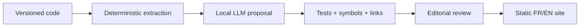

# Documentation & SDK

> Status: methodological draft, to be adapted — not ratified in consuming projects.

## Documentation cannot create an API
A **reference** describes compiled exports; a **guide** explains composition; a **tutorial** exercises learning; a **runbook** governs operations. They carry different editorial authority.

| Kind | Source of truth | Check |
|---|---|---|
| Rust API | public signatures, rustdoc | doctests, API diff |
| Integration SDK | guides + pinned examples | compilation, contracts |
| Network protocol | exposed schema | contract tests |
| Architecture | decisions + boundaries | code and ADR links |
| Runbook | approved operations | controlled rehearsal |

### Mandatory labels
`public-stable`, `public-experimental`, `internal`, `deprecated`, `retired`. A public doc is not a compatibility promise.

### Exercise
An agent fabricates `Surface::morph_to` in a guide. Design the gate that blocks publication.

Self-check
Extract symbols from pinned HEAD, validate links and compile the example. Unknown symbols fail. The agent cannot promote API status.

## Engineering problem
A fictional guide describes a missing export; the reader cannot compile the example.

## Reproducible method
1. Choose reference, tutorial, guide or runbook
2. pin target version
3. extract exports
4. match every used symbol to the inventory
5. run the example
6. separate observed behavior from compatibility status
7. maintain FR/EN together.

**Responsibilities:** the author proposes and records results; the reviewer challenges the oracle; the consuming project owner decides adoption.

## Example, counterexample and failure
Example: Queue.enqueue exists and its example passes. Counterexample: Queue.morph_to comes from an LLM summary. Failure: inventory belongs to another commit; invalidate evidence and extract again.

## Artifacts and qualification
Export inventory; executable example; symbol errors; references and target edition.

Lab B rejects an unknown symbol and runs the known example. Compilation alone proves neither usability nor future API stability.

## Transfer exercise
Apply this method to fictional Courier. Produce the artifacts above, then invent a case that invalidates an overbroad conclusion.

Transfer self-check
The case is fictional and reproducible; baseline is identified; procedure and expected result are explicit; a failure is retained; the conclusion cites artifacts and limits. If any criterion is missing, revise before declaring the method applied.

