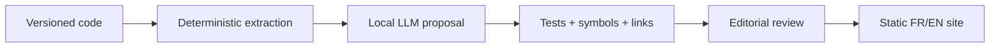

# Documentation & SDK

> Status: methodological draft, to be adapted — not ratified in consuming projects.

## Documentation cannot create an API
A **reference** describes compiled exports; a **guide** explains composition; a **tutorial** exercises learning; a **runbook** governs operations. They carry different editorial authority.

| Kind | Source of truth | Check |
|---|---|---|
| Rust API | public signatures, rustdoc | doctests, API diff |
| Integration SDK | guides + pinned examples | compilation, contracts |
| Network protocol | exposed schema | contract tests |
| Architecture | decisions + boundaries | code and ADR links |
| Runbook | approved operations | controlled rehearsal |

### Mandatory labels
`public-stable`, `public-experimental`, `internal`, `deprecated`, `retired`. A public doc is not a compatibility promise.

### Exercise
An agent fabricates `Surface::morph_to` in a guide. Design the gate that blocks publication.

Self-check
Extract symbols from pinned HEAD, validate links and compile the example. Unknown symbols fail. The agent cannot promote API status.

