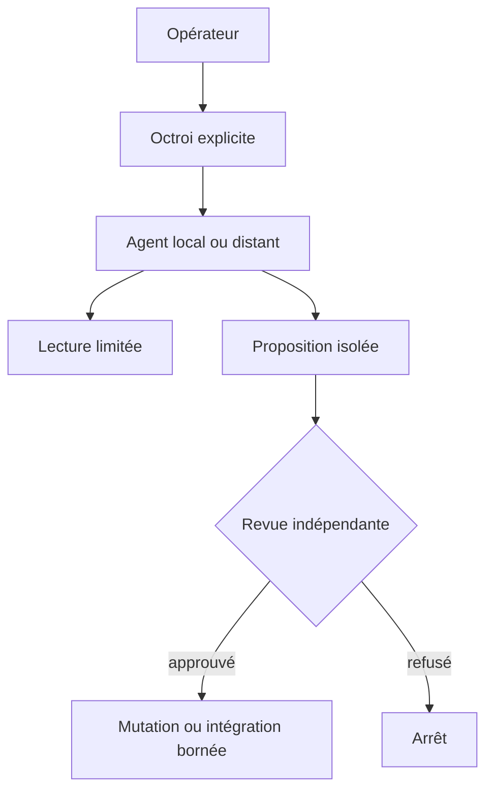

# Autorité & agents

> Statut : brouillon méthodologique, à adapter — non ratifié dans les projets consommateurs.

## L'autorité est un objet, pas un ton
Un agent qui parle avec assurance n'obtient aucun droit additionnel. Une **capacité bornée** déclare ressource, opérations permises et durée maximale.

| Zone | Exemples | Règle |
|---|---|---|
| Observation | lire fichiers, inspecter tests | aucune mutation |
| Proposition | produire patch isolé | aucune intégration |
| Mutation bornée | écrire chemins autorisés | audit du diff |
| Intégration | fusionner une branche | gate distinct |
| Publication | push public, DNS, déploiement | approbation dédiée |

### Frontières LLM
Le point d'entrée Copilot n'est pas une preuve que les prompts restent locaux. Vérifier le fournisseur réel, les points de sortie réseau, la télémétrie, les extensions, les processus enfants et les logs avant toute lecture de secrets ou de code privé.

### Interdiction des permissions transitives
La permission d'écrire dans un worktree n'autorise ni `main`, ni push, ni manipulation de clés, ni approbation de son propre résultat.

### Exercice
Dessine les droits d'un agent qui peut modifier `examples/` mais pas `src/`, et montrer les tests sans utiliser le réseau.

Auto-évaluation
Les permissions doivent nommer `examples/**`, refuser `src/**`, interdire réseau et push, et limiter la durée du mandat. Les logs constituent des traces, pas des délégations.

## Problème traité
Le composant fictif Courier veut écrire un rapport ; son agent possède seulement un droit de lecture.

## Méthode reproductible
1. Lister ressource, opération et expiration
2. vérifier le droit au point d’exécution
3. refuser par défaut les opérations absentes
4. distinguer une proposition locale d’un push autorisé
5. journaliser le refus sans recopier les données protégées.

**Responsabilités :** l’auteur propose et enregistre les résultats ; le relecteur critique l’oracle ; le propriétaire du projet décide de l’adoption.

## Exemple, contre-exemple et échec
Bon exemple : write examples/report.txt autorisé jusqu’à une date UTC. Contre-exemple : un bouton caché tient lieu de contrôle d’accès. Échec : les droits sont vérifiés avant une attente puis réutilisés après expiration ; revérifier à l’exécution.

## Artefacts et qualification
Table de capacités ; cas autorisé, refusé et expiré ; trace de zéro écriture pour les refus.

Chaque cas refusé conserve le fichier témoin byte pour byte. La trace ne démontre que les opérations instrumentées, pas l’absence de toute sortie réseau.

## Exercice de transfert
Applique la méthode au service fictif Courier. Produis les artefacts ci-dessus, puis invente un cas qui invalide une conclusion trop large.

Critères d’auto-évaluation
Le cas est fictif et reproductible ; la baseline est nommée ; la procédure et le résultat attendu sont explicites ; un échec est conservé ; la conclusion cite les artefacts et leurs limites. Si un critère manque, corrige avant de déclarer la méthode appliquée.

