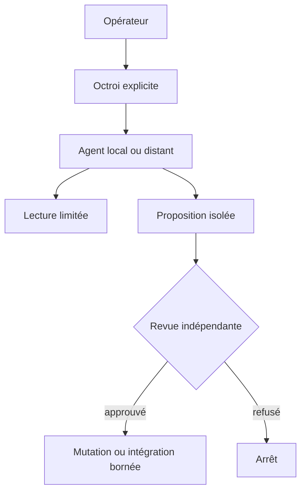

# Autorité & agents

> Statut : brouillon méthodologique, à adapter — non ratifié dans les projets consommateurs.

## L'autorité est un objet, pas un ton
Un agent qui parle avec assurance n'obtient aucun droit additionnel. Une **capacité bornée** déclare ressource, opérations permises et durée maximale.

| Zone | Exemples | Règle |
|---|---|---|
| Observation | lire fichiers, inspecter tests | aucune mutation |
| Proposition | produire patch isolé | aucune intégration |
| Mutation bornée | écrire chemins autorisés | audit du diff |
| Intégration | fusionner une branche | gate distinct |
| Publication | push public, DNS, déploiement | approbation dédiée |

### Frontières LLM
Le point d'entrée Copilot n'est pas une preuve que les prompts restent locaux. Vérifier le fournisseur réel, les points de sortie réseau, la télémétrie, les extensions, les processus enfants et les logs avant toute lecture de secrets ou de code privé.

### Interdiction des permissions transitives
La permission d'écrire dans un worktree n'autorise ni `main`, ni push, ni manipulation de clés, ni approbation de son propre résultat.

### Exercice
Dessine les droits d'un agent qui peut modifier `examples/` mais pas `src/`, et montrer les tests sans utiliser le réseau.

Auto-évaluation
Les permissions doivent nommer `examples/**`, refuser `src/**`, interdire réseau et push, et limiter la durée du mandat. Les logs constituent des traces, pas des délégations.

