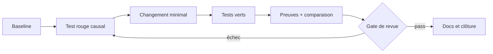

# Tranches & vérification

> Statut : brouillon méthodologique, à adapter — non ratifié dans les projets consommateurs.

## RED → GREEN → preuve
Une tranche commence avec un oracle qui échoue pour la raison attendue, implémente le changement minimal, puis enregistre les résultats. `GREEN` sans contrôle d'environnement ne suffit pas.

| Gate | Minimum observé |
|---|---|
| Prévol | statut Git + outils et versions |
| Causalité | échec initial attendu |
| Correction | tests ciblés verts |
| Non-régression | tests adjacents + lint |
| Qualité | diff-check + sécurité |
| Clôture | commit, limitations, preuve |

### Isolation
Un worktree ou sandbox par tranche indépendante. Ne pas transformer `main` en banc de test. Ne jamais faire d'un CI distant la seule preuve de reproductibilité.

### Exercice
Écris un gate qui échoue si le nombre d'événements attendus change. Identifie un cas où ce gate serait insuffisant.

Auto-évaluation
Le nombre seul manque des identités : vérifier également l'inventaire trié ou un digest et expliquer pourquoi une exemption doit être causalement prouvée.

