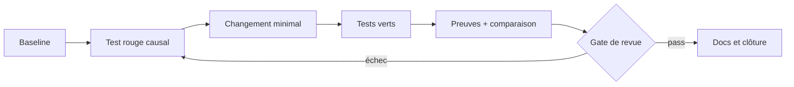

# Tranches & vérification

> Statut : brouillon méthodologique, à adapter — non ratifié dans les projets consommateurs.

## RED → GREEN → preuve
Une tranche commence avec un oracle qui échoue pour la raison attendue, implémente le changement minimal, puis enregistre les résultats. `GREEN` sans contrôle d'environnement ne suffit pas.

| Gate | Minimum observé |
|---|---|
| Prévol | statut Git + outils et versions |
| Causalité | échec initial attendu |
| Correction | tests ciblés verts |
| Non-régression | tests adjacents + lint |
| Qualité | diff-check + sécurité |
| Clôture | commit, limitations, preuve |

### Isolation
Un worktree ou sandbox par tranche indépendante. Ne pas transformer `main` en banc de test. Ne jamais faire d'un CI distant la seule preuve de reproductibilité.

### Exercice
Écris un gate qui échoue si le nombre d'événements attendus change. Identifie un cas où ce gate serait insuffisant.

Auto-évaluation
Le nombre seul manque des identités : vérifier également l'inventaire trié ou un digest et expliquer pourquoi une exemption doit être causalement prouvée.

## Problème traité
Un test vert peut masquer un oracle qui ne distingue jamais l’ancienne version de la nouvelle.

## Méthode reproductible
1. Capturer le prévol
2. écrire un oracle sur les identités et l’ordre
3. exécuter la version fautive et vérifier la raison exacte
4. appliquer la correction
5. exécuter les cas adjacents
6. enregistrer commandes, codes de sortie et diff.

**Responsabilités :** l’auteur propose et enregistre les résultats ; le relecteur critique l’oracle ; le propriétaire du projet décide de l’adoption.

## Exemple, contre-exemple et échec
Bon exemple : [a,a] échoue là où [a] est attendu. Contre-exemple : un test compte deux callbacks sans examiner leurs identités. Échec : le RED vient d’un import absent ; réparer l’environnement avant de conclure.

## Artefacts et qualification
Log RED attendu ; log GREEN ; test adjacent ; diff borné ; manifeste de tranche.

RED échoue sur la propriété ciblée et GREEN passe sur la même entrée. Cette causalité ne remplace pas une revue des cas absents ni une validation de production.

## Exercice de transfert
Applique la méthode au service fictif Courier. Produis les artefacts ci-dessus, puis invente un cas qui invalide une conclusion trop large.

Critères d’auto-évaluation
Le cas est fictif et reproductible ; la baseline est nommée ; la procédure et le résultat attendu sont explicites ; un échec est conservé ; la conclusion cite les artefacts et leurs limites. Si un critère manque, corrige avant de déclarer la méthode appliquée.

