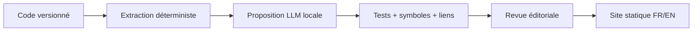

# Documentation & SDK

> Statut : brouillon méthodologique, à adapter — non ratifié dans les projets consommateurs.

## La documentation ne crée pas une API
La **référence** décrit la surface compilée ; le **guide** explique la composition ; le **tutoriel** évalue l'apprentissage ; le **runbook** régit l'exploitation. Leur autorité éditoriale doit être distincte.

| Type | Source de vérité | Vérification |
|---|---|---|
| API Rust | signatures publiques et `rustdoc` | doctests, API diff |
| SDK d'intégration | guides + exemples versions ciblées | compilation/contrats |
| Protocole réseau | schéma réellement exposé | tests de contrat |
| Architecture | décisions et frontières | liens vers code et ADR |
| Runbook | opérations autorisées | répétition contrôlée |

### Labels obligatoires
`public-stable`, `public-experimental`, `internal`, `deprecated`, `retired`. Documentation publiée ≠ engagement de compatibilité.

### Exercice
Un agent invente `Surface::morph_to` dans un guide. Définir l'automate qui bloque sa publication.

Auto-évaluation
Extraire symboles depuis HEAD cible, valider liens et importer un exemple compilable; un nom inconnu provoque un échec. L'agent n'a pas le pouvoir de promouvoir l'API.

## Problème traité
Un guide fictif décrit un export absent ; le lecteur ne peut pas compiler son exemple.

## Méthode reproductible
1. Choisir référence, tutoriel, guide ou runbook
2. épingler la version cible
3. extraire les exports
4. associer chaque symbole utilisé à l’inventaire
5. exécuter l’exemple
6. distinguer comportement observé et statut de compatibilité
7. maintenir FR/EN ensemble.

**Responsabilités :** l’auteur propose et enregistre les résultats ; le relecteur critique l’oracle ; le propriétaire du projet décide de l’adoption.

## Exemple, contre-exemple et échec
Bon exemple : Queue.enqueue existe et son exemple passe. Contre-exemple : Queue.morph_to vient d’un résumé LLM. Échec : l’inventaire est produit sur un autre commit ; invalider la preuve et réextraire.

## Artefacts et qualification
Inventaire d’exports ; exemple exécutable ; erreurs de symbole ; références et édition cible.

L’atelier B bloque le symbole inconnu et exécute l’exemple connu. La compilation seule ne prouve ni l’ergonomie ni la stabilité future de l’API.

## Exercice de transfert
Applique la méthode au service fictif Courier. Produis les artefacts ci-dessus, puis invente un cas qui invalide une conclusion trop large.

Critères d’auto-évaluation
Le cas est fictif et reproductible ; la baseline est nommée ; la procédure et le résultat attendu sont explicites ; un échec est conservé ; la conclusion cite les artefacts et leurs limites. Si un critère manque, corrige avant de déclarer la méthode appliquée.

