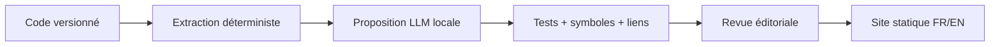

# Documentation & SDK

> Statut : brouillon méthodologique, à adapter — non ratifié dans les projets consommateurs.

## La documentation ne crée pas une API
La **référence** décrit la surface compilée ; le **guide** explique la composition ; le **tutoriel** évalue l'apprentissage ; le **runbook** régit l'exploitation. Leur autorité éditoriale doit être distincte.

| Type | Source de vérité | Vérification |
|---|---|---|
| API Rust | signatures publiques et `rustdoc` | doctests, API diff |
| SDK d'intégration | guides + exemples versions ciblées | compilation/contrats |
| Protocole réseau | schéma réellement exposé | tests de contrat |
| Architecture | décisions et frontières | liens vers code et ADR |
| Runbook | opérations autorisées | répétition contrôlée |

### Labels obligatoires
`public-stable`, `public-experimental`, `internal`, `deprecated`, `retired`. Documentation publiée ≠ engagement de compatibilité.

### Exercice
Un agent invente `Surface::morph_to` dans un guide. Définir l'automate qui bloque sa publication.

Auto-évaluation
Extraire symboles depuis HEAD cible, valider liens et importer un exemple compilable; un nom inconnu provoque un échec. L'agent n'a pas le pouvoir de promouvoir l'API.

